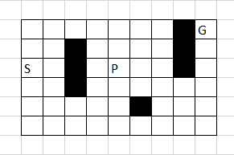

# Q-learning

Q-learning is an off-policy, temporal difference (TD) reinforcement learning algorithm that learns by updating a Q-function.
This action-value function Q directly approximates the optimal action-value function $Q^*$ and it does this independent of the policy that is being followed. 
Q-learning updates with new experience $(s_t, a_t, r_t, s_{t+1})$ in the following way:

$$Q(s_t,a_T) := Q(s_t,a_t) + \alpha ( r_t + \gamma max_a Q(s_{t+1}, a) - Q(s_t,a_t) )$$

With $0 \leq \alpha \leq 1$ being the learning rate, 
and $0 \leq \gamma \leq 1$ being the discount factor.
Higher $\gamma$ values will result in the agent taking into account not only the immediate reward of an action, but also future rewards that will be available in future states as a consequence of this action.
The advantage of tabular Q-learning is that it will always converge to $Q^*$.
It does not matter what behavioral policy is used, 
as long as  each state-action pair is visited an infinite number of times (wiering 2007 [13]).
However, Q-learning combined with function approximators, such as neural networks, have been observed to diverge (wiering 2007).

# SARSA

Like Q-learning, 
SARSA is temporal difference (TD) reinforcement learning algorithm that learns the action-value Q-function (wiering 2007). 
Unlike Q-learning,
SARSA is on-policy,
meaning that the approximation of optimal $Q^*$ values depend on the policy being followed (wiering 2007 [6]).
An experience is defined as the quintuple $(s_t, a_t, r_t, s_{t+1}, a_{t+1})$.
This quintuple is what gave rise to the name SARSA (sutton 2018).
After every transition, Q-values are updated by the following method:

$$Q(s_t,a_T) := Q(s_t,a_t) + \alpha ( r_t + \gamma Q(s_{t+1}, a_{t+1}) - Q(s_t,a_t) )$$

As with tabular Q-learning, tabular SARSA converges towards $Q^*$ if all state-action pairs are visited an infinite number of times.

<!---

wiering 2007

Sarsa. Instead of Q-learning, we can also use the on-policy
algorithm Sarsa [6], [10] for learning Q-values. Sarsa makes
the following update after an experience (s t , a t , r t , s t+1 , a t+1 ):

Q(s t , a t ) := Q(s t , a t ) + α(r t + γQ(s t+1 , a t+1 ) − Q(s t , a t ))

Tabular Sarsa converges in the limit to the optimal policy under
proper learning rate annealing if the exploration policy is GLIE
(greedy in the limit with infinite exploration), which means
that the agent should always explore, but stop exploring after
an infinite number of steps [8].
--->

<!---

sutton 2018

We turn now to the use of TD prediction methods for the control problem. As usual, we
follow the pattern of generalized policy iteration (GPI), only this time using TD methods
for the evaluation or prediction part. As with Monte Carlo methods, we face the need to
trade o↵ exploration and exploitation, and again approaches fall into two main classes:
on-policy and o↵-policy. In this section we present an on-policy TD control method.
The first step is to learn an action-value function rather than a state-value function.
In particular, for an on-policy method we must estimate q ⇡ (s, a) for the current behavior
policy ⇡ and for all states s and actions a. This can be done using essentially the same TD
method described above for learning v ⇡ . Recall that an episode consists of an alternating
sequence of states and state–action pairs:

In the previous section we considered transitions from state to state and learned the
values of states. Now we consider transitions from state–action pair to state–action pair,
and learn the values of state–action pairs. Formally these cases are identical: they are
both Markov chains with a reward process. The theorems assuring the convergence of
state values under TD(0) also apply to the corresponding algorithm for action values:

This update is done after every transition from a nonterminal state S t . If
S t+1 is terminal, then Q(S t+1 , A t+1 ) is defined as zero. This rule uses every
element of the quintuple of events, (S t , A t , R t+1 , S t+1 , A t+1 ), that make up a
transition from one state–action pair to the next. This quintuple gives rise to
the name Sarsa for the algorithm. The backup diagram for Sarsa is as shown
Sarsa
to the right.
It is straightforward to design an on-policy control algorithm based on the Sarsa
prediction method. As in all on-policy methods, we continually estimate q ⇡ for the
behavior policy ⇡, and at the same time change ⇡ toward greediness with respect to q ⇡ .
The general form of the Sarsa control algorithm is given in the box on the next page.
The convergence properties of the Sarsa algorithm depend on the nature of the policy’s
dependence on Q. For example, one could use "-greedy or "-soft policies. Sarsa converges
with probability 1 to an optimal policy and action-value function as long as all state–action
pairs are visited an infinite number of times and the policy converges in the limit to
the greedy policy (which can be arranged, for example, with "-greedy policies by setting
" = 1/t).

--->

# Actor-Critic

The Actor-Critic (AC) is an temporal difference, on-policy learning algorithm.
Where SARSA and Q-learning only keep track on the Q-function,
Actor-Critic will update both a Critic and Actor function (wiering 2008 [1]).
The Critic function assigns values to the states, 
irrespective of the action chosen by the agent.
The Actor function will for each action map the states to preference values (wiering 2008).
An experience is defined as the sequence ($(s_t, a_t, r_t, s_{t+1})$).
After each experience,
the Critic and Actor get updated as follows [wiering 2008[11]]:

$$ \text{Critic: } V(s_t) := V(s_t) + \beta ( r_t + \gamma V(s_{t+1}) - V(s_t) ) $$

$$ \text{Actor: } P(s_t, a_t) := P(s_t, a_t) + \alpha ( r_t + \gamma V(s_{t+1}) - V(s_t) ) $$

Where $\beta$ is the learning rate of the Critic 
and $\alpha$ the learning rate of the Actor.
P-values should not be seen as literal Q-values, 
but instead as preference values.

<!---

wiering 2008 

Actor-Critic. The Actor-Critic (AC) method is an on-policy
algorithm like Sarsa. In contrast to Q-learning and Sarsa, AC
methods keep track of two functions; a Critic that evaluates
states and an Actor that maps states to a preference value
for each action [1]. After an experience (s t , a t , r t , s t+1 ) AC
makes a temporal difference (TD) update to the Critic’s value-
function V :

V (s t ) := V (s t ) + β(r t + γV (s t+1 ) − V (s t ))

where β is the learning rate. AC updates the Actor’s values
P (s t , a t ) as follows:

P (s t , a t ) := P (s t , a t ) + α(r t + γV (s t+1 ) − V (s t ))

where α is the learning rate for the Actor. The P-values should
be seen as preference values and not as exact Q-values.

--->

<!---

wiering 2007

Actor-Critic. Another on-policy algorithm is the Actor-
Critic (AC) method. In contrary to Q-learning and Sarsa, AC
methods keep track of two functions; a Critic that evaluates
states and an Actor that maps states to a preference value
for each action. A number of Actor-Critic methods have been
proposed [1], [4], [11]. Here we will use the Actor-Critic
method described in [11]. After an experience (s t , a t , r t , s t+1 )
AC makes a TD-update to the Critic’s value-function V :

V (s t ) := V (s t ) + β(r t + γV (s t+1 ) − V (s t ))

where β is the learning rate. AC updates the Actor with values
P (s t , a t ) as follows:

P (s t , a t ) := P (s t , a t ) + α(r t + γV (s t+1 ) − V (s t ))

where α is the learning rate for the Actor. The P-values
should be seen as preference values and not as exact Q-values.
Consider a bandit problem with one state and two actions.
Both actions lead to an immediate deterministic reward of 1.
When one action is selected a number of times in a row or
the initial learning rate is 1, the state or V-value and the P-
value for this action converge rapidly to 1. Afterwards the
P-value of the other action can never increase anymore using
AC and will not converge to the underlying Q-value of 1.
A number of Actor-Critic methods have still been proved to
converge to the optimal policy and state value-function for
tabular representations [4].

--->

# QV-learning

QV-learning (wiering 2008[6]) is very similar to Actor-Critic.
It is also a learning method that learns a state value-function V with TD method, 
and an Actor function to map the states for each action to preference values.
However, QV-learning learns actual Q-values as preference values (wiering 2008).
After each experience $(s_t, a_t, r_t, s_{t+1})$,
the V value-function is updates in the same way as in the Actor-Critic method (wiering 2007):

$$ V(s_t) := V(s_t) + \beta ( r_t + \gamma V(s_{t+1}) - V(s_t) )   $$

The update for the Q-function is similar to the Actor update,
but the $- V(s_t)$ at the end is replaced by $- Q(s_t, a_t)$:

$$ \text{Qvalue: } Q(s_t, a_t) := Q(s_t, a_t) + \alpha ( r_t + \gamma V(s_{t+1}) - Q(s_t, a_t))$$

<!---

wiering 2008

QV-learning. QV-learning [6] works by keeping track of
both the Q- and V-functions. In QV-learning the state value-
function V is learned with TD-methods [19]. This is similar
to Actor-Critic methods. The new idea is that the Q-values
simply learn from the V-values using the one-step Q-learning
algorithm. In contrast to AC these learned values can be seen
as actual Q-values and not as preference values. The updates
after an experience (s t , a t , r t , s t+1 ) of QV-learning are the use
of Equation 1 and:

Q(s t , a t ) := Q(s t , a t ) + α(r t + γV (s t+1 ) − Q(s t , a t ))

Note that the V-value used in this second update rule is learned methods have been used for combining function approximators
by QV-learning and not defined in terms of Q-values. There is to store the value function [14], [15], [16], [17], and this can
a strong resemblance with the Actor-Critic method; the only be an efficient way for improving an RL algorithm. In contrast
difference is the second learning rule where V (s t ) is replaced to previous research, we combine different RL algorithms that
by Q(s t , a t ) in QV-learning.

--->

<!---

wiering 2007

Abstract— This paper describes two novel on-policy reinforce-
ment learning algorithms, named QV(λ)-learning and the actor
critic learning automaton (ACLA). Both algorithms learn a state
value-function using TD(λ)-methods. The difference between the
algorithms is that QV-learning uses the learned value function
and a form of Q-learning to learn Q-values, whereas ACLA uses
the value function and a learning automaton-like update rule to
update the actor. We describe several possible advantages of these
methods compared to other value-function-based reinforcement
learning algorithms such as Q-learning, Sarsa, and conventional
Actor-Critic methods. Experiments are performed on (1) small,
(2) large, (3) partially observable, and (4) dynamic maze problems
with tabular and neural network value-function representations,
and on the mountain car problem. The overall results show
that the two novel algorithms can outperform previously known
reinforcement learning algorithms.

QV-learning. The updates after an experience
(s t , a t , r t , s t+1 ) of QV-learning are the following:

V (s t ) := V (s t ) + β(r t + γV (s t+1 ) − V (s t ))

Q(s t , a t ) := Q(s t , a t ) + α(r t + γV (s t+1 ) − Q(s t , a t ))

Note that the V-value used in this second update rule is learned
by QV-learning and not defined in terms of Q-values. There is
a strong resemblance with the Actor-Critic method; the only
difference is the second learning rule where V (s t ) is replaced
by Q(s t , a t ) in QV-learning.
--->

# ACLA (Actor-Critic Learning Automaton)

Actor-Critic Learning Automaton (ACLA)(wiering 2008[6]) is an on-policy learning algorithm that learns a state value-function V and Actor function P.
After each experience 

wiering 2008 $(s_t, a_t, r_t, s_{t+1})$,
the state value-function is updated in the same way as Actor-Critic or QV-learning (wiering 2007):

$$ \delta_t = r_t + \gamma V(s_{t+1}) - V(s_t) $$

$$ V(s_t) := V(s_t) + \beta ( \delta_t ) $$

The actor function maps states to preferences for actions
and is updated by an automaton-like updating rule (wiering 2008 [20])
The policy mapping update depends on the sign of $\delta$:

$\delta_t \geq 0$

$$ a = a_t: P(s_t, a_t) := P(s_t, a_t) + \alpha ( 1 - P(s_t, a_t)) $$

$$ \forall a \neq a_t:  P(s_T, a) := P(s_t, a) + \alpha ( 0 - P(s_t, a))$$

$\delta_t < 0$

$$ a = a_t: P(s_t, a_t) := P(s_t, a_t) + \alpha ( 0 - P(s_t, a_t)) $$

$$ \forall a \neq a_t:  P(s_t, a) := P(s_t, a) + \alpha \left( \frac{P(s_t, a)}{\sum_{b \neq a_t}P(s_t, b)} - P(s_t, a) \right)$$

There are also additional rules to ensure that the target values are between 0 and 1 and existing.
If $P(s_t,a)$ is greater than 1, the value gets changed to 1.
If $P(s_t,a)$ is smaller than 0, the value gets changed to zero.
If the denominator is 0, the new value equals $\frac{1}{|A| -1}$,
with $|A|$ being the number of actions (wiering 2008).

<!---

wiering 2007

Abstract— This paper describes two novel on-policy reinforce-
ment learning algorithms, named QV(λ)-learning and the actor
critic learning automaton (ACLA). Both algorithms learn a state
value-function using TD(λ)-methods. The difference between the
algorithms is that QV-learning uses the learned value function
and a form of Q-learning to learn Q-values, whereas ACLA uses
the value function and a learning automaton-like update rule to
update the actor. We describe several possible advantages of these
methods compared to other value-function-based reinforcement
learning algorithms such as Q-learning, Sarsa, and conventional
Actor-Critic methods. Experiments are performed on (1) small,
(2) large, (3) partially observable, and (4) dynamic maze problems
with tabular and neural network value-function representations,
and on the mountain car problem. The overall results show
that the two novel algorithms can outperform previously known
reinforcement learning algorithms.

Actor Critic Learning Automaton. ACLA learns a state
value-function in the same way as QV-learning, but ACLA
uses a learning automaton-like update rule [5] for changing
the policy mapping states to probabilities (or preferences) for
actions. The updates after an experience (s t , a t , r t , s t+1 ) of
ACLA are the following:

V (s t ) := V (s t ) + β(r t + γV (s t+1 ) − V (s t ))

and, now we use an update rule that examines whether the last
performed action was good (in which case the state-value was
increased) or not. We do this with the following update rule:

if ...
else ...

After which we add ΔP (s t , a) to P (s t , a). For ACLA we used
some additional rules to ensure the targets are always between
0 and 1, independent of the initialization. This is done by using
1 if the target is larger than 1, and 0 if the target is smaller
than 0. If the denominator ≤ 0, all targets in the last part of
1
where |A| is the number of
the update rule get the value |A|−1
actions. The update in case of δ t < 0 is chosen to increase the
preference of actions which are good more than actions that
are considered worse. Above is the ACLA− algorithm, we
also extended ACLA− to ACLA+ which can make multiple
updates relying on the size of δ t = γV (s t+1 ) + r t − V (s t ).

--->

<!---

wiering 2008

ACLA. The Actor Critic Learning Automaton (ACLA) [6]
learns a state value-function in the same way as AC and QV-
learning, but ACLA uses a learning automaton-like update rule
[20] for changing the policy mapping states to probabilities
(or preferences) for actions. The updates after an experience
(s t , a t , r t , s t+1 ) of ACLA are the use of Equation 1, and
now we use an update rule that examines whether the last
performed action was good (in which case the state-value was
increased) or not. We do this with the following update rule:

If δ t ≥ 0
∆P (s t , a t ) = α(1 − P (s t , a t )) and
∀a 6 = a t ∆P (s t , a) = α(0 − P (s t , a))

Else
∆P (s t , a t ) = α(0 − P (s t , a t )) and
...

where δ t = γV (s t+1 ) + r t − V (s t ), and ∆P (s, a) is added to
P (s, a). ACLA uses some additional rules to ensure the targets
are always between 0 and 1, independent of the initialization
(e.g. of neural network weights). This is done by using 1 if
the target is larger than 1, and 0 if the target is smaller than
0. If the denominator is less than or equal to 0, all targets
1
in the last part of the update rule get the value |A|−1
where
|A| is the number of actions. ACLA was shown to outperform
Q-learning and Sarsa on a number of problems when ǫ-greedy
exploration was used [6].

--->

# Majority voting

Each of the n RL algorithms defines what it thinks to be the best action.
Majority voting will transform these best actions into preferences in the following way:

$$ p_t(s_t, a[i]) = \sum_{j=1}^{n} I(a[i],a_t^j) $$

with $a_t^j$ being the best action according to algorithm j at time t and

$$ x=y: I(x,y) = 1 $$

$$ x \neq y: I(x,y) = 0 $$

The following Boltzmann distribution based ensemble policy is used for actions selection:

$$ \pi_t (s_t, a[i]) = \frac{exp[\frac{p_t(s_t, a[i])}{\tau}]}{\sum_k exp[\frac{p_t(s_t, a[k])}{\tau}]} $$

This policy makes sure that the most probable action is the best action according to most algorithms, but also ensures exploration (wiering 2008).

<!---

wiering 2008

Majority Voting. The preference values calculated by the
majority voting ensemble using n different RL algorithms are

p t (s t , a[i]) =
n
X
I(a[i], a jt )

where I(x, y) is the indicator function that outputs 1 when
x = y and 0 otherwise. The most probable action is simply
the action that is most often the best action according to
the algorithms. This method resembles a bagging ensemble
method for combining classifiers with majority voting, with
the big difference that because of exploration we do not always
select the action which is preferred by most algorithms.

--->

# Rank voting

Preference values of the ensemble are give by:

$$ p_t(s_t, a[i]) = \sum_{j=1}^{n} r_t^j(a[i]) $$

If m actions are possible in state $s_t$,
$r_t^j(a[1])$, $r_t^j(a[2])$, ... , $r_t^j(a[m])$ 
denotes the weights for these actions as determined by RL algorithm j.
The most probable action is weighted m times, the second best m-1 times, and so on...
(wiering 2008).
As with majority voting, 
the rank voting algorithm uses the following Boltzmann distribution based ensemble policy to ensure both exploitation and exploration:

$$ \pi_t (s_t, a[i]) = \frac{exp[\frac{p_t(s_t, a[i])}{\tau}]}{\sum_k exp[\frac{p_t(s_t, a[k])}{\tau}]} $$

<!---

wiering 2008

Rank Voting. Let r t j (a[1]), . . . , r t j (a[m]) denote the weights
according to the ranks of the action selection probabilities,
such that if π t j (a[i]) ≥ π t j (a[k]) then r t j (a[i]) ≥ r t j (a[k]). For
example, the most probable action could be weighted m times,
the second most probable m − 1 times and so on. This is the
weighting we used in our experiments. The preference values
of the ensemble are:

...

--->

# Boltzmann multiplication

Boltzmann multiplication calculates the ensemble preferences by multiplying for each action the action-selection probabilities given by the RL algorithms:

$$ p_t(s_t, a[i]) = \prod_j \pi_t^j (s_t, a[i]) $$

$\pi_t^j(s_t, a[i])$ is the policy for algorithm j at time t for state $s_t$ and action $a[i]$.
Since all the RL algorithms use Boltzmann exploration, 
preference values are never zero.
This is important since if only one RL algorithm return zero,
Boltzmann multiplication would result for a zero probability for that action,
irrespectively of that the other algorithms return high or low probabilities.
The ensemble policy for actions selection is calculated in the following way:

$$ \pi_t (s_t, a[i]) = \frac{ p_t(s_t, a[i])^{\frac{1}{\tau}}}{\sum_k p_t(s_t, a[k])^{\frac{ 1 }{\tau}}} $$

<!---

wiering 2008

Boltzmann Multiplication. Another possibility is multiply-
ing all the action selection probabilities for each action based
on the policies of the algorithms. The preference values of the
ensemble are:

...

A potential problem with this method is that one algorithm
can set the preference values of any number of actions to zero
when it has a zero probability of choosing those actions. Since
all our algorithms use Boltzmann exploration, this was not an
issue in our experiments.

--->

# Boltzmann addition

The formula  of Boltzmann addition looks very similar to Boltzmann multiplication,
with the product being replaced by a sum:

$$ p_t(s_t, a[i]) = \sum_j \pi_t^j (s_t, a[i]) $$

As concept however,
it is a variant of rank voting where $ r_t^j=\pi_t^j $.
The ensemble policy for actions selection is calculated in the same way as Boltzmann multiplication:

$$ \pi_t (s_t, a[i]) = \frac{ p_t(s_t, a[i])^{\frac{1}{\tau}}}{\sum_k p_t(s_t, a[k])^{\frac{ 1 }{\tau}}} $$

<!---

Boltzmann Addition. As a last method, we can also sum
the action selection probabilities of the different algorithms.
Essentially, this is a variant of rank voting, using r t j = π t j .
The preference values of the ensemble are:

...

--->

# Experiments

We compared five different RL algorithms (Q-learning, SARSA, Actor-Critic, QV-learning, ACLA) with each other and with four ensemble methods (Majority Voting, Rank Voting, Boltzmann Multiplication, Boltzmann Addition).
The goal for the agents was to solve five different maze tasks of varying complexity,
In each maze, the agent starts at a certain starting position and needs to reach another goal position.
The dominating objective was to move with each step closer to the goal.
For the first experiment,
the agents learned to solve a small base where start, goal and walls were in static position. 
To do this, they combined RL algorithms with a tabular expression.
For the second to fifth maze,
complexity was increased by adding different dynamic elements to the maze.
To circumvent the combination explosion that would occur in a tabular expression,
neural networks were used as function approximators.
In each tile of the maze, the agent can initiate 4 actions: going North, East, South or West.
These actions are noisy,
meaning that every time an action is taken, there is a 20% chance that the agent performs a random action instead.
For each maze, the rewards were given in the following way.
If the agent moves into the goal tile, 
it receives a reward of 100.
When it tries to move into a wall or border,
it will receive a reward of -2 and remain in the same place (state is not changed).
For every other move (moving from one tile to the next),
the agent receives a reward of -0.1.
Even though it does not collide with a wall or border, 
it gets a negative score to discourage it from wandering around.
An agent learns in different trials.
Such trial starts with the agent in the starting position 
and ends when it reaches the goal positions 
or has wandered for 1000 consecutive action without reaching the goal.

<!---

wiering 2008

We performed experiments with five different maze tasks
(one simple and four more complex problems) to compare the
different ensemble methods to the individual algorithms. In
the first experiment, the RL algorithms are combined with
tabular representations and are compared on a small maze
task. In the second experiment a partially observable maze
is used and neural networks as function approximators. In the
third experiment a dynamic maze is used where the obstacles
are not placed at fixed positions and neural network function
approximators are used. In the fourth experiment a dynamic
maze is used where the goal is not placed at a fixed position
and neural networks are used as function approximators. In
the fifth and final experiment a generalized maze [23] task
is used where the goal and the obstacles are not placed at
fixed positions and again neural networks are used as function
approximators.

--->

## Small Maze experiment

The first experiment was the least complex,
so that the agent could use tabular expression for the different state-action pairs.
We implemented Sutton's Dyna maze,
which consist of 54 tiles (6 rows and 9 columns).
The maze also includes 7 walls, a starting and goal, all in fixed position (Fig. \ref{simpleMaze}).

 
In order to compare our results with those of (wiering 2008),
we used the same learning rates, discount factors and greediness (inverse of Boltzmann temperature) parameters.
In their paper, they explain how they tested a wide range of parameters 
to optimize each of the five RL algorithms final performance (by evaluating the average reward).
They wanted to compare the best version of each algorithm,
which was not possible if the same parameters were used.
For the ensemble methods, they used the same parameters as were determined for the single RL algorithms.
(wiering 2008) observed the discount factor to have a major impact on the final and cumulative score.
For the SARSA method, discount factors 0.90 and 0.95,
and for the ACLA method, discount factors 0.99 and 0.90
were compared to each other.
We wanted to confirm these findings, 
so we did simulations with the same discount factors.
    
<!---

wiering 2008

The different ensemble methods: majority voting, rank
voting, Boltzmann addition, and Boltzmann multiplication, are
compared to the 5 individual algorithms: Q-learning, Sarsa,
AC, QV-learning, and ACLA. We performed experiments with
Sutton’s Dyna maze shown in Figure 1(A). This simple maze
consists of 9 × 6 states and there are 4 actions; north, east,
south, and west. The goal is to arrive at the goal state G as
soon as possible starting from the starting state S under the
influence of stochastic (noisy) actions. We kept the maze small,
since we want to compare the results with the experiments on
the more complex maze tasks, which would otherwise cost too
much computational time.

The reward for arriving at the goal
is 100. When the agent bumps against a wall or border of
the environment it stays still and receives a reward of -2.
For other steps the agent receives a reward of -0.1. A trial
is finished after the agent hits the goal or 1000 actions have
been performed. The random replacement (noise) in action
execution is 20%. This reward function and noise is used in
all experiments of this paper.

We used a tabular representation and first performed simu-
lations to find the best learning rates, discount factors, and
greediness (inverse of the temperature) used in Boltzmann
exploration. All parameters were optimized for the single RL
algorithms, where they were evaluated using the average re-
ward intake and the final performance is optimized. Although
in general it can cause problems to learn to optimize the
discounted reward intake while evaluating with the average
reward intake, for the studied problems the dominating ob-
jective is to move each step closer to the goal, which is
optimized using both criteria if the discount factor is large
enough. We also optimize the discount factors, since we found
that they had a large influence on the results. If we would
have always used the same discount factor for all algorithms,
the results of some algorithms would have been much worse,
and therefore it would be impossible to select a fair discount
factor. Since we evaluate all methods using the average reward
criterion, the different discount factors do not influence the
comparison between algorithms. The ensemble methods used
the parameters of the individually optimized algorithms, so
that only the ensemble’s temperature had to be set.

--->