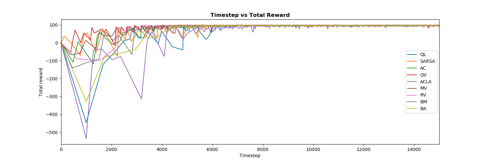
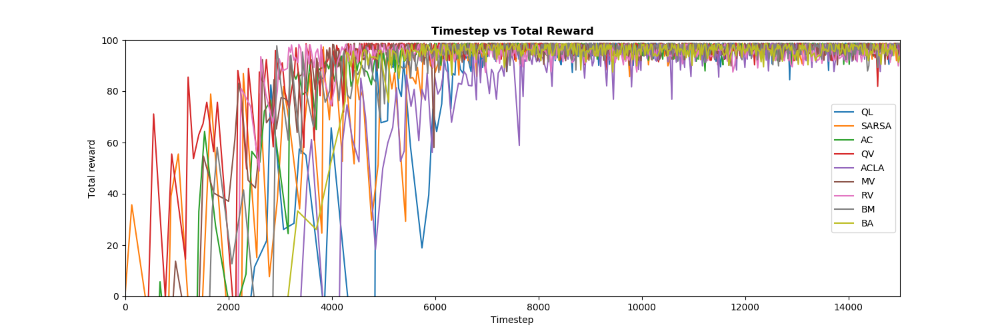

CGT project results

# Results

## Simple Maze

The evaluation was done by noting the Final Reward intake during the last 2500 learning-steps of each simulation. Also the cumulative average reward was calculated after every 2500 learning-steps. Each simulation has 50,000 learning-steps. Table 1 shows the average results and the standard deviation of 500 such simulations.
 

| Method          | $\alpha$ | $\beta$ | $\gamma$ | G   | Final          | Cumulative     |
|-----------------|----------|---------|----------|-----|----------------|----------------|
| Q               | 0.2      |    -    | 0.9      | 1   | 5.20 +/- 0.19  | 89.66 +/- 4.82 |
| SARSA           | 0.2      |    -    | 0.9      | 1   | 5.20 +/- 0.18  | 91.08 +/- 4.16 |
| AC              | 0.1      |   0.2   | 0.95     | 1   | 5.21 +/- 0.20  | 95.12 +/- 5.96 |
| QV              | 0.2      |   0.2   | 0.9      | 1   | 5.21 +/- 0.18  | 92.24 +/- 4.08 |
| ACLA            | 0.005    |   0.1   | 0.99     | 9   | 5.18 +/- 0.14  | 85.32 +/- 3.59 |
| Majority Voting |     -    |    -    |     -    | 1.6 | 5.19 +/- 0.19  | 94.46 +/- 3.63 |
| Rank Voting     |     -    |    -    |     -    | 0.6 | 4.89 +/- 0.29  | 88.80 +/- 6.74 |
| Boltzmann Mult. |     -    |    -    |     -    | 0.2 | 5.23 +/- 0.15  | 94.00 +/- 2.99 |
| Boltzmann Add.  |     -    |    -    |     -    | 1   | 5.04 +/- 0.32  | 93.18 +/- 6.97 |

 

\begin{table}[]
\begin{tabular}{|l|l|c|l|l|l|l|}
\hline
\multicolumn{1}{|r|}{\textbf{Method}} & $\alpha$               & \multicolumn{1}{l|}{$\beta$} & $\gamma$               & G   & Final         & \textbf{Cumulative} \\ \hline
Q                                     & 0.2                    & -                            & 0.9                    & 1   & 5.20 +/- 0.19 & 89.66 +/- 4.82      \\ \hline
SARSA                                 & 0.2                    & -                            & 0.9                    & 1   & 5.20 +/- 0.18 & 91.08 +/- 4.16      \\ \hline
AC                                    & 0.1                    & 0.2                          & 0.95                   & 1   & 5.21 +/- 0.20 & 95.12 +/- 5.96      \\ \hline
QV                                    & 0.2                    & 0.2                          & 0.9                    & 1   & 5.21 +/- 0.18 & 92.24 +/- 4.08      \\ \hline
ACLA                                  & 0.005                  & 0.1                          & 0.99                   & 9   & 5.18 +/- 0.14 & 85.32 +/- 3.59      \\ \hline
Majority Voting                       & \multicolumn{1}{c|}{-} & -                            & \multicolumn{1}{c|}{-} & 1.6 & 5.19 +/- 0.19 & 94.46 +/- 3.63      \\ \hline
Rank Voting                           & \multicolumn{1}{c|}{-} & -                            & \multicolumn{1}{c|}{-} & 0.6 & 4.89 +/- 0.29 & 88.80 +/- 6.74      \\ \hline
Boltzmann Mult.                       & \multicolumn{1}{c|}{-} & -                            & \multicolumn{1}{c|}{-} & 0.2 & 5.23 +/- 0.15 & 94.00 +/- 2.99      \\ \hline
Boltzmann Add.                        & \multicolumn{1}{c|}{-} & -                            & \multicolumn{1}{c|}{-} & 1   & 5.04 +/- 0.32 & 93.18 +/- 6.97      \\ \hline
\end{tabular}
\end{table}

 
It was observed that Majority voting and Boltzmaann Multiplication have the best Final as well as the Cumulative reward intake. In the current experiment, Boltzmann addition has the worst performance. 

In order to examine the effect of hte discount factor ($\gamma$) , the SARSA and the ACLA algorithms are rerun with different discount factors. The results are shown in table 2.
 

| Method | $\alpha$ | $\beta$ | $\gamma$ | G | Final         | Cumulative      |
|--------|----------|---------|----------|---|---------------|-----------------|
| SARSA  | 0.2      | -       | 0.95     | 1 | 4.96 +/- 0.90 | 87.04 +/- 17.08 |
| ACLA   | 0.005    | 0.1     | 0.9      | 9 | 4.27 +/- 1.8  | 60.87 +/- 29.48 |

 

\begin{table}[]
\begin{tabular}{|l|l|l|l|l|l|l|}
\hline
Method & $\alpha$ & $\beta$ & $\gamma$ & G & Final         & Cumulative      \\ \hline
SARSA  & 0.2      & -       & 0.95     & 1 & 4.96 +/- 0.90 & 87.04 +/- 17.08 \\ \hline
ACLA   & 0.005    & 0.1     & 0.9      & 9 & 4.27 +/- 1.8  & 60.87 +/- 29.48 \\ \hline
\end{tabular}
\end{table}

 
There is a significant drop in the performance of both algorithms as compared to the previous simulations. 

Figure 1 and 2 plots the total reward obtained by the algorithms vs the timestep. For the sake of clarity results are plotted till 15,000 timesteps. It can be observed that all algorithms converge to a stable performance within 15,000. From this comparision it can also be seen that the convergence of ACLA is the slowest.

 

## Maze with dynamic obstacles

Figure 3 plots the total reward over timesteps for a Maze with Dynamic obstacles. 

 
